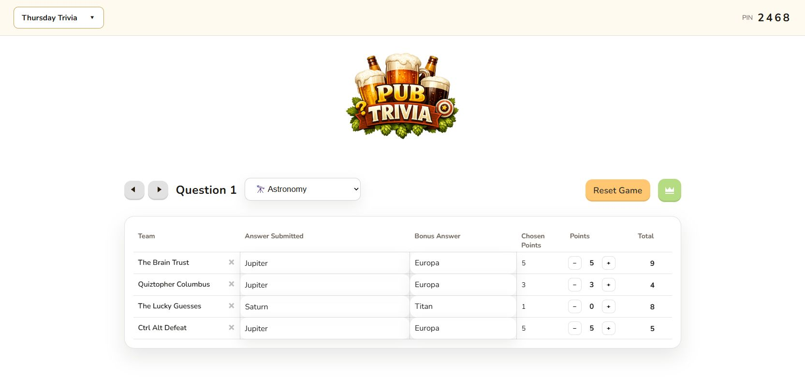
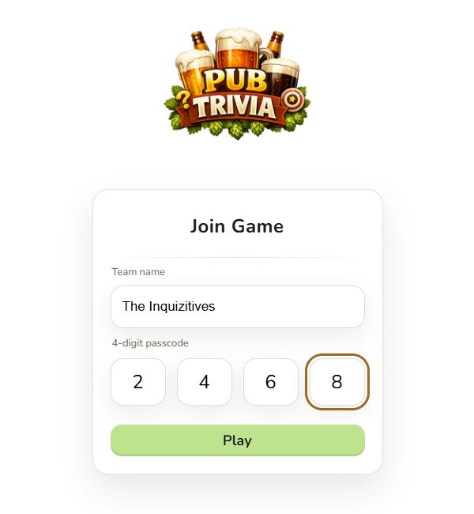
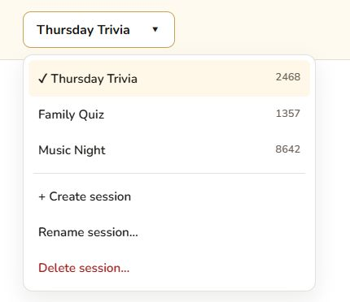
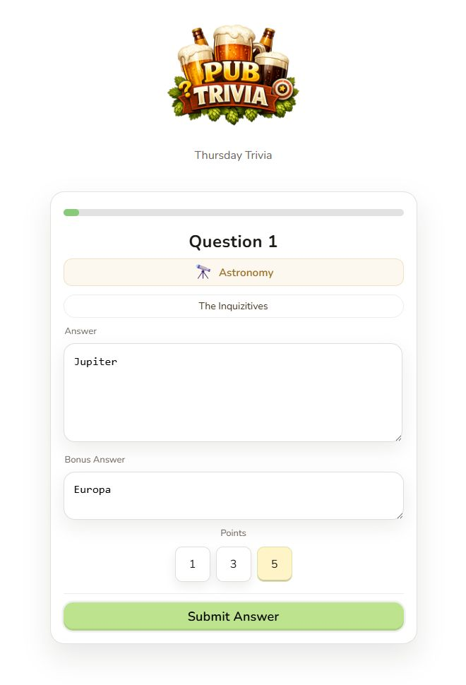
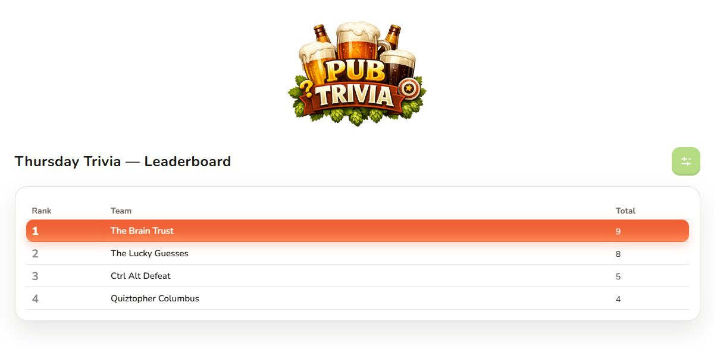

# 🍻 Open Trivia Night

Run trivia games from a browser: hosts manage questions and scoring, and teams join with a four-digit PIN. One Node.js server serves the web pages and API, with game data stored in SQLite. Multiple named sessions can run at the same time, each with its own PIN, teams, answers, scores, and leaderboard.



*The host dashboard keeps session selection, question categories, answers, and scoring together. Screenshots use the default branding and fictional demo games.*

## Choose an installation

| Where you want to run it | Instructions | Game storage |
| --- | --- | --- |
| Your Windows PC, Mac, or Linux computer | [Local setup](#local-setup-windows-macos-and-linux) | SQLite file on your computer |
| A Linux server or VM that stays running | [Linux server with PM2](#linux-server-with-pm2) | SQLite file on the server's persistent disk |
| A computer or server with Docker | [Docker](#docker) | SQLite in a named Docker volume |
| Google Cloud Run | [Cloud Run](#google-cloud-run) | Instance-local by default; see the storage limitations below |
| A platform that accepts a Procfile | [Other hosting platforms](#other-hosting-platforms) | Depends on the platform's persistent storage |

All commands below run from the repository root unless stated otherwise. The frontend needs the API, so open the app through the running server rather than opening the HTML files directly.

## Local setup: Windows, macOS, and Linux

### 1. Install the prerequisites

Install Git, then install **Node.js 24 with npm** using the [official Node.js downloads](https://nodejs.org/en/download). Node 24 is the version used by this project's Docker image and CI. Open a new terminal after installation and check:

```text
node --version
npm --version
```

On Windows, use PowerShell or Command Prompt. WSL is optional; the app runs natively on Windows. If you choose WSL, install Node and the project dependencies inside WSL. Install dependencies separately on each operating system because `better-sqlite3` includes a native module.

### 2. Download and install

```text
git clone https://github.com/ChrisToumanian/open-trivia-night.git
cd open-trivia-night
npm ci
```

If you already have the project, open a terminal in that folder and run `npm ci`. There is no separate frontend build or database installation step; the server creates the database on first start.

### 3. Start the server

```text
npm start
```

Keep the terminal open while playing. Press **Ctrl+C** to stop the server.

If PowerShell reports that `npm.ps1` cannot run because scripts are disabled, use `npm.cmd ci` and `npm.cmd start`, or use Command Prompt.

The included Windows launcher is another option after dependencies are installed:

```powershell
.\start-local.ps1
```

### 4. Open and test the app

| Page | Local address |
| --- | --- |
| Host dashboard | [localhost:8080/host.html](http://localhost:8080/host.html) |
| Team join page | [localhost:8080/play.html](http://localhost:8080/play.html) |
| Server health check | [localhost:8080/api/health](http://localhost:8080/api/health) |

Open the host dashboard, then open the join page in another tab and join with the displayed PIN. Submit an answer and check that it appears on the host dashboard. Joining takes players to the questions view; use the host's leaderboard link to view scores for the selected session.

<p align="center">
  
</p>

*Teams enter a name and the PIN shown on their host's dashboard, then select Play.*

To play from phones or another computer on the same network, replace `localhost` with the server computer's LAN IP address, for example `http://192.168.1.50:8080/play.html`. Allow the app's port through the computer's firewall on that network. `localhost` on a phone refers to the phone itself.

### Use a different port

Windows PowerShell:

```powershell
.\start-local.ps1 -Port 8081
```

Or set the variable before `npm start`:

```powershell
$env:PORT = '8081'
npm.cmd start
```

macOS / Linux / WSL:

```bash
PORT=8081 npm start
```

Use the same port in your browser URLs. Environment variables set in a terminal apply to processes started from that terminal.

## Running multiple sessions

A fresh database starts with **Trivia Night**, PIN **0000**. An existing database keeps its current game when upgraded.

1. Open `host.html` and use the dropdown at the top left of the top bar.
2. Choose **Create session**, give it a name, and accept the suggested PIN or enter an unused four-digit PIN. Leading zeros are supported.
3. Share that session's PIN and the player join URL with its teams.
4. Select another session in the dropdown to manage a different game. Scores save before switching, and each session remembers the host's last-viewed question.



*The checked game is selected in this host tab. Each game has its own name and PIN.*

Teams, answers, scores, selected question categories, and leaderboards stay separate. The question/round configuration and available category catalog are shared across sessions. You can also open each session's host URL, including its `?sessionId=...`, in a separate tab. Player tabs keep their own session membership.

| Action | Effect |
| --- | --- |
| **Rename session** | Changes its name and keeps its PIN, teams, and scores. |
| **Reset Game** | Clears that session's teams, answers, scores, and selected categories. Keeps the session and lets you keep or change its PIN. |
| **Delete session** | Removes the selected session and its game data after confirmation. Other sessions continue. |

Players affected by a reset or deletion return to the join page. A reset session's players must join again. To enter a different game at any time, open `play.html` and use its PIN.

## Playing and scoring

### Submit answers

The host presents each question. Teams use the questions page to enter their answer, add a bonus answer when enabled, choose from the available point values, and select **Submit Answer**. The session name and team name identify which game they are playing.

<p align="center">
  
</p>

*The player view shows the current question, category, and available points. Question and round rules come from the shared game configuration.*

### Award points and view standings

On the host dashboard, review each team's answers and use the **+** and **−** controls to award points. The **Total** column adds the team's awarded points across questions. Open the crown-shaped **Leaderboard** link to show the selected session's standings; its return link goes back to that session's host dashboard.



*Each session has its own leaderboard, with the leading team highlighted.*

## Linux server with PM2

Use this for a Linux server or VM with persistent disk storage. Follow the [local setup](#local-setup-windows-macos-and-linux) to install Node 24, clone the repository, install dependencies, and confirm `npm start` works. Stop that foreground server before starting PM2 on the same port.

1. Install PM2 under the account that will run the app:

   ```bash
   npm install --global pm2
   ```

2. Edit [`ecosystem.config.js`](ecosystem.config.js): set `cwd` to the repository's absolute path. Its supplied value is `/home/ubuntu/open-trivia-night`. Adjust `PORT` in `env` if needed. Keep the supplied single-process configuration (`instances: 1`, `exec_mode: 'fork'`).
3. Start the app and configure restart after reboot:

   ```bash
   pm2 start ecosystem.config.js
   pm2 startup
   ```

   Run the command printed by `pm2 startup`, then save the process list:

   ```bash
   pm2 save
   ```

Use the same account for day-to-day PM2 commands. See [PM2's startup guide](https://pm2.keymetrics.io/docs/usage/startup/) for service setup and changes after a Node upgrade.

```bash
pm2 status
pm2 logs open-trivia-night
```

Open `http://YOUR_SERVER_IP:8080/host.html` and `/play.html`, or use your configured domain. For HTTPS with your own domain, configure a reverse proxy to forward to the app's port; see [ports and HTTPS](#ports-and-https).

To update, first stop the app and [back up its data](#data-backups-and-upgrades). Then, from the repository folder:

```bash
pm2 stop open-trivia-night
# Back up the data directory before continuing.
git pull --ff-only
npm ci
pm2 restart open-trivia-night
```

The older `install.sh`, `start.sh`, and `stop.sh` helpers assume an Ubuntu-specific path or use `sudo pm2`. The commands above make the service account and path explicit.

## Docker

Install Docker with Linux-container support, then clone the repository and open its folder. Node and npm are installed inside the image; they are not required on the host.

Build and start:

```text
docker build -t open-trivia-night:latest .
docker run -d --name trivia-night --restart unless-stopped -p 8080:8080 -v trivia-data:/app/data open-trivia-night:latest
```

Open [the host dashboard](http://localhost:8080/host.html) or [the join page](http://localhost:8080/play.html). On a remote server, replace `localhost` with its address. To use host port 8081, change the mapping to `-p 8081:8080`.

The named volume `trivia-data` stores `quiz.db` outside the container and survives container replacement. Keep this volume and back it up; removing it removes the saved games. Without the volume mount, data stays inside the container being replaced.

View logs with `docker logs -f trivia-night` (press Ctrl+C to leave the log view). To stop the app:

```text
docker stop trivia-night
```

Restart a stopped container with `docker start trivia-night`. To deploy updated code, update your checkout and build the image again, then replace the container using the same volume:

```text
docker build -t open-trivia-night:latest .
docker stop trivia-night
docker rm trivia-night
docker run -d --name trivia-night --restart unless-stopped -p 8080:8080 -v trivia-data:/app/data open-trivia-night:latest
```

Run one app container for this setup; separate containers with separate databases will have separate games.

## Google Cloud Run

The app supports Cloud Run's container startup: the included Dockerfile uses Node 24, and the server listens on `0.0.0.0` using the supplied `PORT`. Cloud Run provides HTTPS, so certificates are not needed inside the container. See the [Cloud Run container contract](https://docs.cloud.google.com/run/docs/container-contract).

**Storage:** the current app uses SQLite inside each instance. Cloud Run's writable container filesystem is temporary, so games can be lost when an instance stops or is replaced. Separate instances cannot share sessions or coordinate PINs. Limiting scaling does not make this storage durable. See [Cloud Run filesystem behavior](https://docs.cloud.google.com/run/docs/container-contract#filesystem).

For durable games across Cloud Run restarts or multiple instances, the application needs a shared database integration. Cloud SQL is not currently implemented; setting `DATA_DIR` alone does not add persistence or change database backends. A Linux server or Docker host with persistent storage supports the current SQLite design directly.

### Deploy from source

Use Google Cloud Shell, or an authenticated local Google Cloud CLI. You need a project with billing enabled and permissions for source deployment, including the build service account. Follow Google's [source deployment prerequisites and IAM roles](https://docs.cloud.google.com/run/docs/deploying-source-code#before_you_begin).

Clone the repository as shown in local setup, or open your existing checkout. Local Node and Docker installations are not needed for this deployment path. Replace `YOUR_PROJECT_ID` below. If updating an existing service, use its existing service name and region instead of the example values.

```text
gcloud config set project YOUR_PROJECT_ID
gcloud services enable run.googleapis.com cloudbuild.googleapis.com artifactregistry.googleapis.com
gcloud run deploy open-trivia-night --source . --region us-west1 --allow-unauthenticated
```

`--allow-unauthenticated` makes the service public. This app has **no host authentication**: anyone who can reach the API can perform host actions. Game PINs select sessions; they do not protect host controls. Account for this when choosing who can access a deployment.

The source deployment builds using this repository's Dockerfile through Cloud Build. No `cloudbuild.yaml` or Git push trigger is included in the repository. See [how source deployment works](https://docs.cloud.google.com/run/docs/deploying-source-code).

When deployment finishes, open the returned service URL with `/host.html` for hosting or `/play.html` for teams. To redeploy later, update the checkout to the code you want to release and run the same deployment command:

```text
git pull --ff-only
gcloud run deploy open-trivia-night --source . --region us-west1 --allow-unauthenticated
```

## Other hosting platforms

For platforms that support Node buildpacks and a Procfile, the included [`Procfile`](Procfile) declares:

```text
web: node api/https-server.js
```

Select Node 24, install dependencies with `npm ci`, and use that web process (or `npm start`). The app reads the platform's `PORT`. Check that the platform supplies persistent local storage for SQLite; otherwise the same data-loss and instance-isolation limitations described above apply. Host access also needs protection when exposed publicly.

## Configuration and branding

Defaults work without creating any override files. To customize a setting, copy its default file to the override path and edit the copy:

| Purpose | Default file | Optional override |
| --- | --- | --- |
| Question and round rules | [`shared/config.default.json`](shared/config.default.json) | `shared/config.json` |
| Available question categories | [`shared/categories.default.json`](shared/categories.default.json) | `shared/categories.json` |
| Theme, logo, and footer branding | [`shared/brand.default.json`](shared/brand.default.json) | `shared/brand.json` |

Restart the server after changing question configuration or the category catalog. Refresh the browser after branding changes. For container deployments, rebuild and redeploy after changing files included in the image.

`shared/config.json` and `shared/brand.json` are ignored by Git, so arrange to copy them to your deployment checkout when needed. `shared/categories.json` is not ignored. Review which customizations should be committed before updating or deploying.

The frontend files live in [`frontend/`](frontend/): edit `header.html`, `footer.html`, `styles.css`, or the individual page files for further customization. The default header logo is `frontend/images/logo-header.png`.

## Data, backups, and upgrades

| Variable | Default | Meaning |
| --- | --- | --- |
| `PORT` | `8080` | Port used by the server. |
| `DATA_DIR` | `data/` inside the repository | Directory containing `quiz.db`; created on startup if needed. |

The service account must be able to write to the data directory. Prefer an absolute path when setting `DATA_DIR`. For example:

```powershell
# Windows PowerShell
$env:DATA_DIR = 'C:\trivia-data'
npm.cmd start
```

```bash
# Linux / macOS
DATA_DIR=/var/lib/open-trivia-night npm start
```

For the Linux example, create the directory and grant the app's service account write access first. With PM2, put `DATA_DIR` in the `env` block of `ecosystem.config.js`; the Docker example already mounts its storage at the default `/app/data` location.

Before upgrading, stop the running app, copy its entire data directory (or back up its Docker volume), and keep the backup separately. Preserve that storage when replacing code or containers. Local Git updates do not include `data/` because it is ignored by Git.

The first upgrade from the older single-game database automatically creates `quiz.db.before-sessions-*.bak` beside the database. It preserves the previous current game and retains older reset history as inactive records. Ambiguous duplicate or orphaned records stop migration with an error instead of silently discarding data. Keep the backup if you need to restore the previous version; the upgraded schema is not intended for the older server code.

If the SQLite CLI is installed, inspect the default database from the repository root with `sqlite3 data/quiz.db`.

## Ports and HTTPS

The app serves both the frontend and `/api/*` on one port and listens on all network interfaces. It uses HTTP unless both `privkey.pem` and `fullchain.pem` exist at the legacy path `/etc/letsencrypt/live/zipfx.net/`, in which case it serves HTTPS directly.

For a different domain, use a reverse proxy for HTTPS or change the certificate paths in [`api/https-server.js`](api/https-server.js). Cloud Run terminates HTTPS externally. Use the appropriate `http://` or `https://` scheme for your setup.

## Tests and development

After `npm ci`, run:

```text
npm run lint
npm test
npm run test:load
```

- `npm run lint` checks JavaScript syntax.
- `npm test` checks session isolation, validation, database migration, and browser session storage using disposable databases.
- `npm run test:load` simulates **five sessions with five players each answering five questions**. It checks scoring, polling, isolation, and persistence after a server restart, using its own temporary disk database. It takes about 30 seconds and writes `data/load-test-report.json`.

These tests do not change your running game's database. See [the recorded load-test results and limits](docs/load-test-results.md) for the measured local workload.

[GitHub Actions](.github/workflows/ci.yml) runs HTML linting, JavaScript syntax checks, and tests on Node 24 for pull requests and pushes to `main`. The load test is run separately. To require CI before merging, configure branch protection to require **Lint** and **Tests**. This workflow does not deploy the app.

## Troubleshooting

| Symptom | What to check |
| --- | --- |
| `node` or `npm` is not recognized | Install Node 24 with npm, reopen the terminal, and verify both version commands. |
| PowerShell blocks `npm.ps1` or the local launcher | Use `npm.cmd ci` / `npm.cmd start`, or Command Prompt. |
| `better-sqlite3` fails to load after moving the project | Run `npm ci` on the target OS with Node 24. Do not reuse another OS's `node_modules`. Check installation output for any native build requirements. |
| `EADDRINUSE` / port already in use | Stop the older app process or choose another port, then update the browser URL. |
| A phone cannot connect | Use the server's LAN IP, keep both devices on a reachable network, and check the firewall and port. |
| Database cannot be opened or written | Check `DATA_DIR`, directory ownership, and the service account's write permissions. |
| Games disappear after a container replacement | Reuse the same persistent volume. On Cloud Run, review its instance-local storage limitations above. |
